# Instalación de Java
## Windows
### 1. Descargar Java
Abre la página [Java Platform (JDK) 12](https://www.oracle.com/technetwork/java/javase/downloads/index.html).

En la sección Java Platform (JDK) 12, haz click en DOWNLOAD.
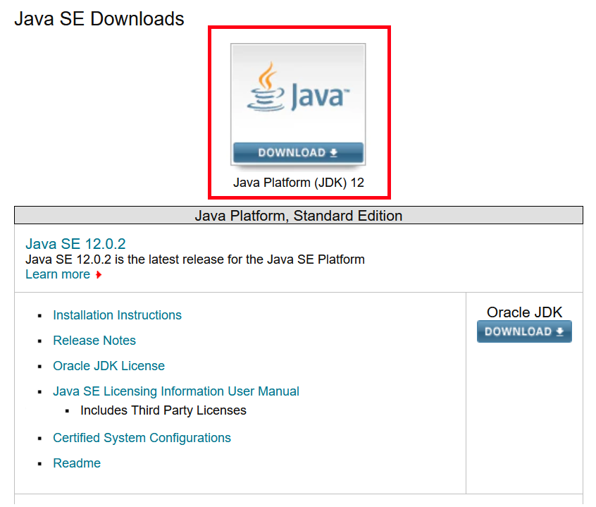

Navega hasta la parte de abajo, y selecciona la versión de `Windows`. Acepta la ligencia y elige la versión ejecutable (con terminación .exe): 
`jdk-12.0.2_windows-x64_bin.exe`
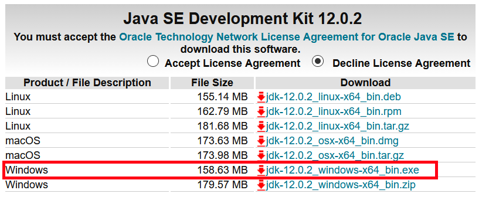

Descarga y ejecuta el archivo descargado.

### Instalación
Ejecuta el wizard.
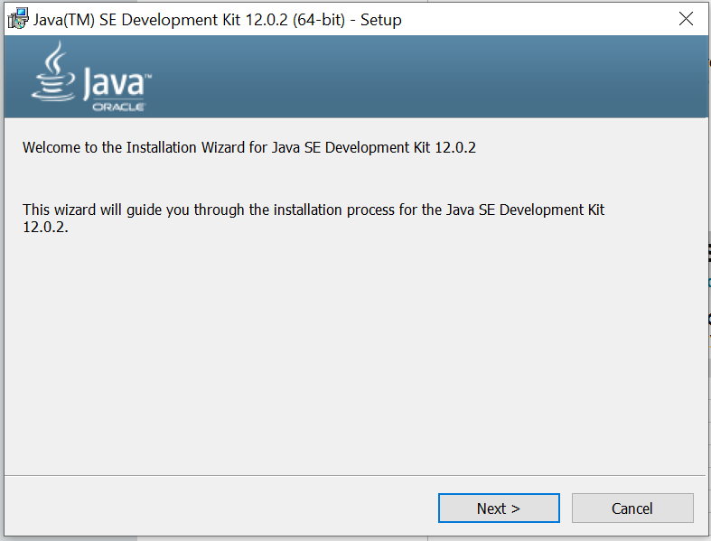

Identifica el folder en el que se está realizando la instalación. Por defecto, Java propone:
`C:\Program Files\Java\jdk-12.0.2\`
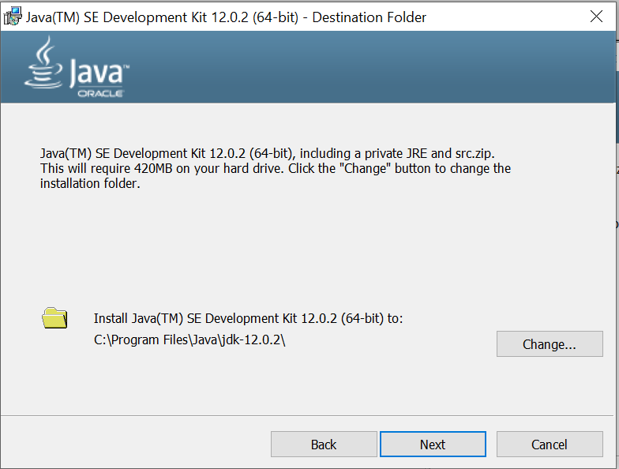

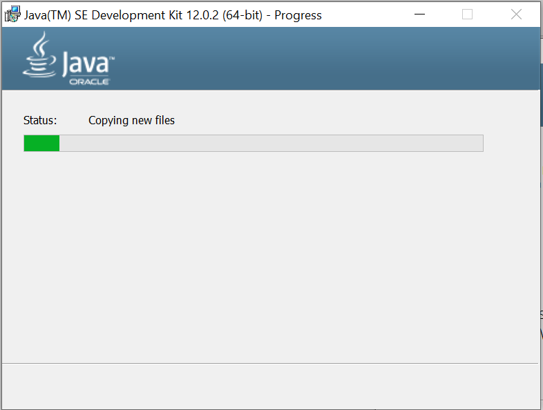
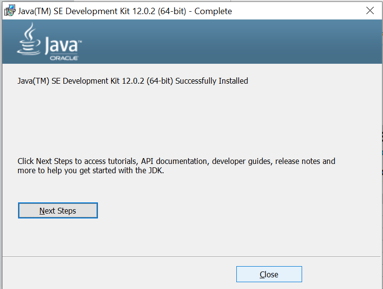

Cierra el instalador y abre `Command Prompt` haciendo click en <kbd>Win</kbd> + <kbd>R</kbd>.

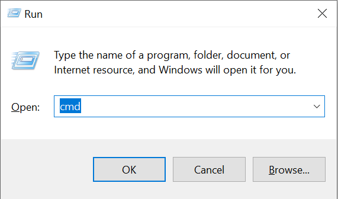

En consola, escribe la instrucción
`java`

El mensaje `'java' is not recognized as an internal or external command,
operable program or batch file.` deberá aparecer.

NOTA: En este momento Java ya está instalado y es utilizable, pero 

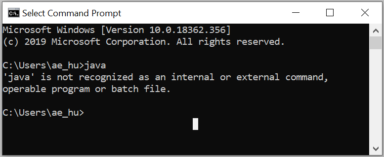

### Editar variables de entorno
En el menú Start, busca `This PC` (`Este Equipo` en español.) Haz click derecho sobre el ícono y selecciona la opción `Properties`. 

Selecciona la opción `Advanced System Settings`.
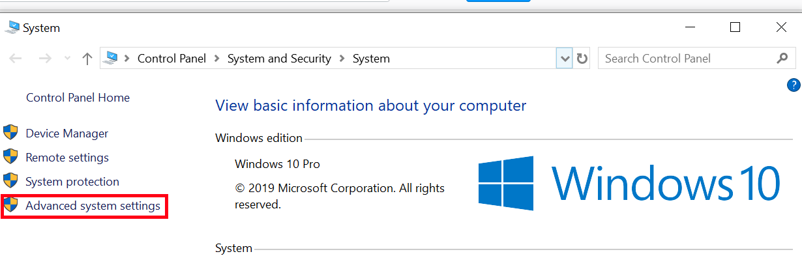

Haz click sobre `Environmental Variables...`
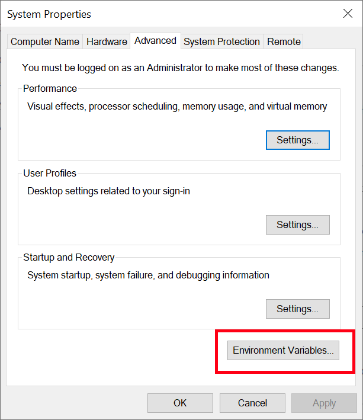

En la sección de `System variables`, selecciona `Path` y haz click sobre `Edit`.
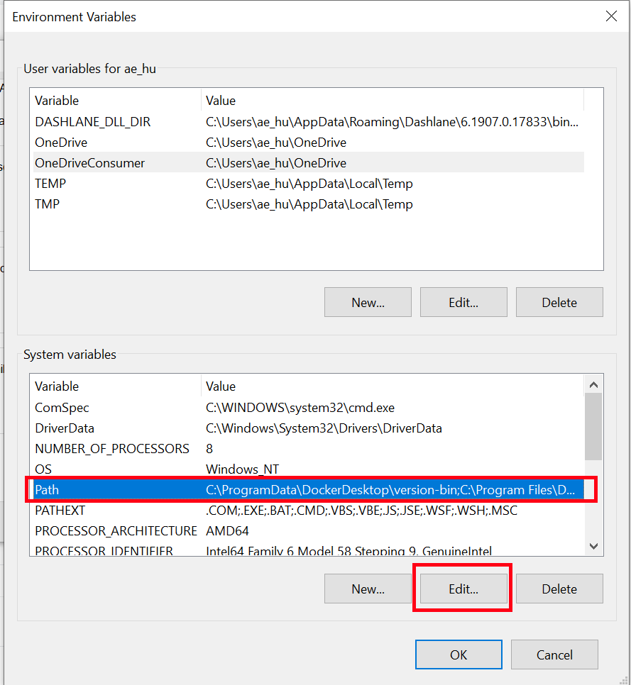

Agrega una nueva entrada en la lista de entradas haciendo click sobre `New` e insertando la ruta en donde Java está instalado, incluyendo el folder `bin`: `C:\Program Files\Java\jdk-12.0.2\bin`. 
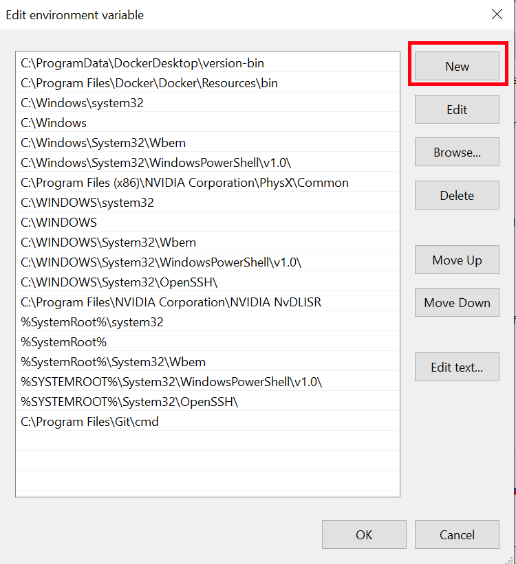

Haz click en `OK` para salir.

### Verificar instalación
Vuelve a abrir `Command Prompt` haciendo click en <kbd>Win</kbd> + <kbd>R</kbd>.

En consola, escribe la instrucción
`java -version`

La versión que elegiste al instalar la aplicación deberá aparecer aquí.
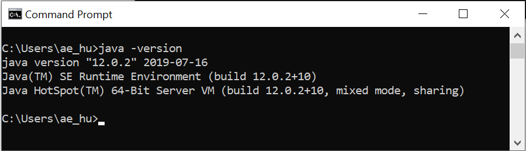
## Mac OS X
